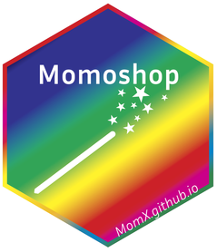

<!-- README.md is generated from README.Rmd. Please edit that file -->

# Momoshop <a href="https://momx.github.io/Momoshop/"></a>

<!-- badges: start -->

[](https://CRAN.R-project.org/package=Momoshop)
[](https://lifecycle.r-lib.org/articles/stages.html#experimental)
[](https://github.com/MomX/Momoshop/actions/workflows/R-CMD-check.yaml)
<!-- badges: end -->

The goal of Momoshop is to provide a convenient way to handle processing
of images after acquisition and before morphometrics

It uses [shiny](https://shiny.posit.co/) to wrap most useful
[magick](https://github.com/ropensci/magick) functions for that purpose.

## Installation

Once released on CRAN, you can install the development version of
Momoshop like so:

``` r
install.packages("Momoshop")
```

Momoshop is part of [MomX](https://momx.github.io/) a very young and
still experimental ecosystem. During its development and also before
CRAN releases, you may better get the development version instead:

``` r
pak::pkg_install("MomX/Momoshop")
```

## How to use it

Launch the app on your images and usage should be self-explanatory.
Momoshop also has a manual inside the app.

``` r
library(Momoshop)
## basic example code
```

The app returns a magick ‘pipe’ that you can use outside the app to
post-process

``` r
library(magick)
#> Linking to ImageMagick 6.9.12.3
#> Enabled features: cairo, fontconfig, freetype, heic, lcms, pango, raw, rsvg, webp
#> Disabled features: fftw, ghostscript, x11
```
